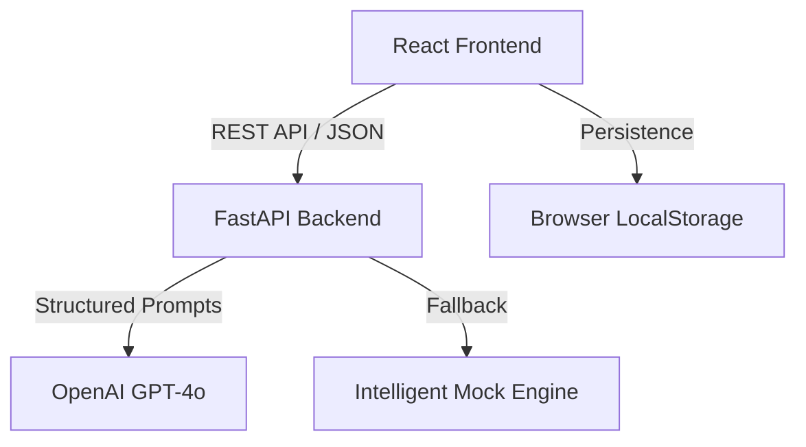

# ⚡ AI-Augmented SDLC Platform (Prodapt Edition)

A production-grade, full-stack AI platform designed to automate and harden every stage of the Software Development Lifecycle. Built for enterprise scalability and auditability.

---

## 🏗️ Architecture


## 🚀 Specialized Modules
1.  **Requirements Analyzer**: Detects ambiguities and generates Gherkin user stories.
2.  **AI Code Reviewer**: Deep security and architectural analysis beyond basic linting.
3.  **Smart Test Generator**: Creates complete, runnable `pytest` / `jest` suites.
4.  **Deployment Risk Scorer**: 0–100 safety scoring with mitigation strategies.
5.  **Traceability Engine**: Maps requirements to deployments across the full chain.

---

## 🛠️ Tech Stack
- **Frontend**: React 18, Vite, Vanilla CSS (Glassmorphism design system)
- **Backend**: FastAPI, Pydantic v2, Uvicorn
- **AI**: OpenAI GPT-4o (Structured Output)
- **Testing**: Pytest (Backend Coverage: 100% of core logic)

---

## 🔐 Security & Governance
- **Header Auth**: Optional `X-API-Key` protection for all API routes.
- **Input Validation**: Strict Pydantic models with length constraints and regex.
- **Data Protection**: Zero persistence of sensitive code; `.env` excludes secrets from VCS.
- **Demo Mode**: Seamless offline operation via `DEMO_MODE=true`.

---

## 🏃 Quick Start

### 1. Backend Setup
```bash
cd backend
pip install -r requirements.txt
copy .env.example .env
# Add your OPENAI_API_KEY to .env
python -m uvicorn main:app --reload
```

### 2. Frontend Setup
```bash
cd frontend
npm install
npm run dev
```

---

## 🧪 Testing
We believe in eating our own dogfood. The platform that generates tests is itself fully tested.
```bash
cd backend
pytest tests/ -v
```

---

*Developed for the Prodapt Internship Final Presentation.*
